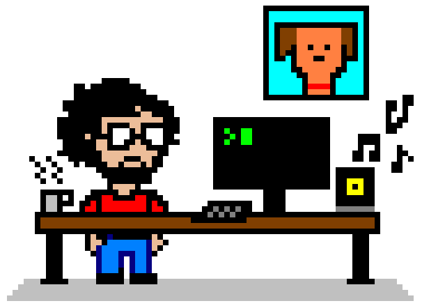

<!-- Header -->

    
    <h1>
      Hey there, I'm Michael! 
      
    </h1>
    <h3>
      I'm a music playing, animal loving, improv performing, software developing human.
    </h3>

 
<!-- About -->

  
💻 Always learning computer things

  
🐶 Pet Poppa to a dog and 2 cats 🐱🐱

  
🎶 Currently listening to: <a href="https://www.youtube.com/@Macroblank" target="_blank"><i>Macroblank</i> 🌊 
</a>

  <h3>Yearly Goals:</h3>
  

🥅 2022 Goals

      

      
Security+ cert ✅

      
Enroll in Web Dev Bootcamp ✅

  

  

🥅 2023 Goals

      

      
<a href="https://github.com/mjr2595/Nucamp-Fullstack-Course" target="_blank">Nucamp Full Stack Web + Mobile Development cert -- with honors!</a> ✅

      
(Check out my honors project: <a href="https://github.com/mjr2595/borker" target="_blank">Barkbook</a>)

      
Get a dev job

      
Launch <a href="https://github.com/mjr2595/tidy-app" target="_blank">Tidy app</a> 🚀

  

 
<!-- Git -->

  

  

  <h3>👇 Some featured projects 👇</h3>

